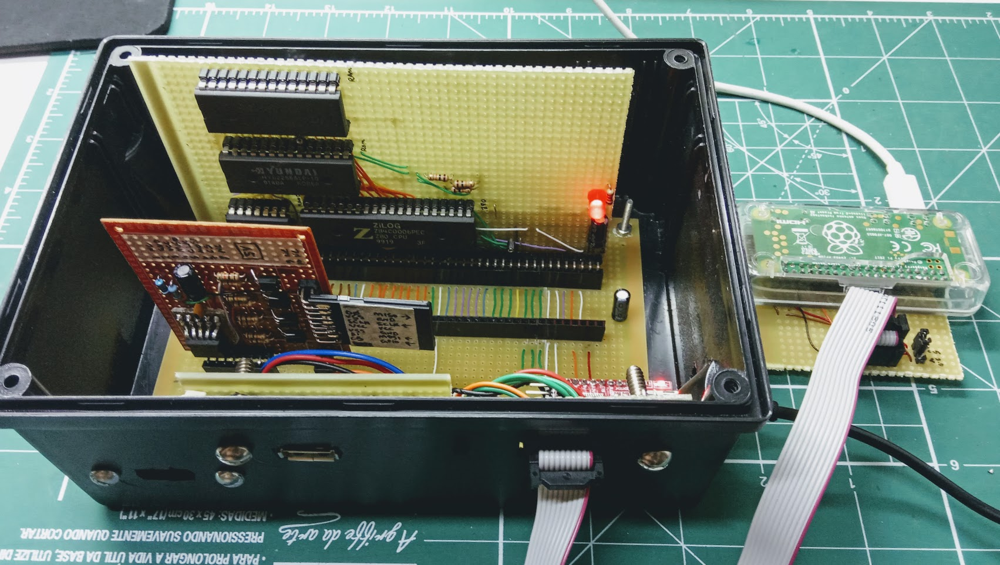

# Fortuna-1
**Fortuna-1** is custom Z80 computer that can be fully debugged from a PC.

See the links below for documentation and schematics on each of the boards:

|Board|Porpuse|Documentation|
|-----|-------|-------------|
|**Motherboard**| Provide interconnection between the pins of all boards. | [Wiki](https://github.com/andrenho/fortuna-1/wiki/Motherboard)
|**Controller** | Handle initialization, manages Z80 and memory and provides debugging functionality. | [Wiki](https://github.com/andrenho/fortuna-1/wiki/Controller)
|**Computer**   | The heart of the computer - the Z80 processor and RAM. | [Wiki](https://github.com/andrenho/fortuna-1/wiki/Computer)
|**I/O**        | Handle USB keyboard, provide audio and VGA output. | [Wiki](https://github.com/andrenho/fortuna-1/wiki/IO-board)

See also the [Programmer's Guide](https://github.com/andrenho/fortuna-1/wiki/Programmers's-Guide) on how the computer operates from the programmer standpoint.

The [Protocol](https://github.com/andrenho/fortuna-1/wiki/Protocol) describe the communication protocol between Fortuna-1 and the debugger, among others.
